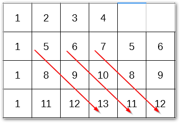

# Tupel

## Problembeschreibung

Gegeben sei ein Tupel mit n Elementen für n >= 3.

Gesucht sind alle Tupel jeweils mit 4 Elementen, dessen Tupel jeweils genau 1 gemeinsames Element
mit allen anderen Tupel hat.

Beispiel 1: Tupel mit 3 Elementen.

A | B | C | Beschreibung
--|---|---|-------------------------------------------------------
1 | 2 | 3 | In jeder anderen Zeile ist genau eine 1 oder 2 oder 3.
1 | 4 | 5 | In jeder anderen Zeile ist genau eine 1 oder 4 oder 5.
1 | 6 | 7 | In jeder anderen Zeile ist genau eine 1 oder 6 oder 7.
2 | 4 | 6 | ...
2 | 5 | 7 | ...
3 | 4 | 7 | ...
3 | 5 | 6 | ...

## Algorithmus

### Feld initialisieren

### Ersten vier Reihen

Die ersten vier Reihen ergeben sich aus dem initialisierten Feld.

A | B  | C  | D
--|----|----|---
1 |  2 |  3 |  4
1 |  5 |  6 |  7
1 |  8 |  9 | 10
1 | 11 | 12 | 13

### Zweiten drei Reihen

Die nächsten drei Reihen ergeben sich jeweils aus 1 runter 0 rechts.

A | B | C  | D
--|---|----|---
2 | 5 |  8 | 11
2 | 6 |  9 | 12
2 | 7 | 10 | 13

### Dritten drei Reihen

Die nächsten drei Reihen ergeben sich jeweils aus 1 runter 1 rechts.

A | B | C  | D
--|---|----|---
3 | 5 |  9 | 13
3 | 6 | 10 | 11
3 | 7 |  8 | 12

### Vierten drei Reihen

Die nächsten drei Reihen ergeben sich jeweils aus 1 runter 2 rechts.

A | B | C  | D
--|---|----|---
4 | 5 | 10 | 12
4 | 6 |  8 | 13
4 | 7 |  9 | 11

### Ergebnis

In der Summe ergeben sich 13 Tupel mit jeweils 4 Elementen.

Nr | A | B  | C  | D
---|---|----|----|---
1  | 1 |  2 |  3 |  4
2  | 1 |  5 |  6 |  7
3  | 1 |  8 |  9 | 10
4  | 1 | 11 | 12 | 13
5  | 2 |  5 |  8 | 11
6  | 2 |  6 |  9 | 12
7  | 2 |  7 | 10 | 13
8  | 3 |  5 |  9 | 13
9  | 3 |  6 | 10 | 11
10 | 3 |  7 |  8 | 12
11 | 4 |  5 | 10 | 12
12 | 4 |  6 |  8 | 13
13 | 4 |  7 |  9 | 11
